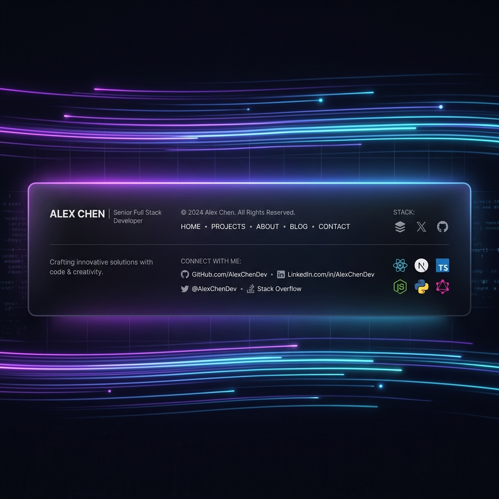

<h1 align="center">👋 Hi, I'm <a href="https://github.com/kpriyadharsan">Priyadharsan K</a></h1>

<h3 align="center">MERN Developer | AI Enthusiast | DSA Specialist | ECE Student</h3>

  Passionate about architecting <strong>robust full-stack solutions</strong> that harmonize artificial intelligence with seamless user experiences. 
  I’m driven by the vision of <strong>Innovation Through Code</strong> — building human-centric software that solves real-world challenges through logic and creativity.

---

<h2 align="center">🌱 About Me</h2>

  I'm a software engineer who specializes in the <strong>MERN stack</strong> and deep-dives into <strong>Data Structures and Algorithms</strong> using Java.  
  My journey is defined by a relentless pursuit of efficiency — from mastering complex algorithms to integrating <strong>AI-driven features</strong> into web ecosystems. 
  Projects like <strong>SpeechXO</strong> and <strong>Jerry</strong> reflect my focus: designing systems that aren't just functional, but truly intelligent.

---

<h2 align="center">⚙️ Core Tech Stack</h2>

  
  
  
  
  
  

---

<h2 align="center">🧩 Frameworks & Libraries</h2>

  
  
  
  

---

<h2 align="center">☁️ Databases & Deployment</h2>

  
  
  

---

<h2 align="center">💻 Tools & Environments</h2>

  
  
  
  

---

<h2 align="center">📊 GitHub Pulse</h2>

  
  

---

<h2 align="center">🌐 SEO & Discoverability</h2>

  As a developer, <strong>Priyadharsan</strong> is dedicated to crafting high-performance digital ecosystems. Known as a <strong>Priyadharsan React Developer</strong>, I bring modern aesthetic and logic to frontend engineering. My journey is documented through various <strong>Priyadharsan AI Projects</strong> and this <strong>Priyadharsan Vb Portfolio</strong>, demonstrating a commitment to solving the unsolvable.

---

<h2 align="center">🤝 Connect With Me</h2>

  
  &nbsp;&nbsp;
  
  &nbsp;&nbsp;
  

---

   
  
   
  <strong>“Turning complex logic into elegant experiences.”</strong> 
  🚀 <i>Priyadharsan K | Engineering the Future with AI & MERN</i>

  

